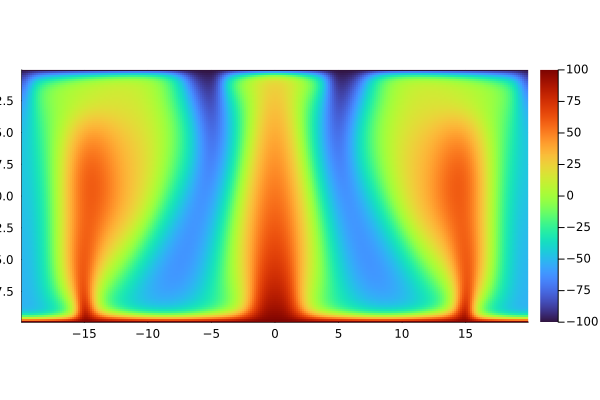
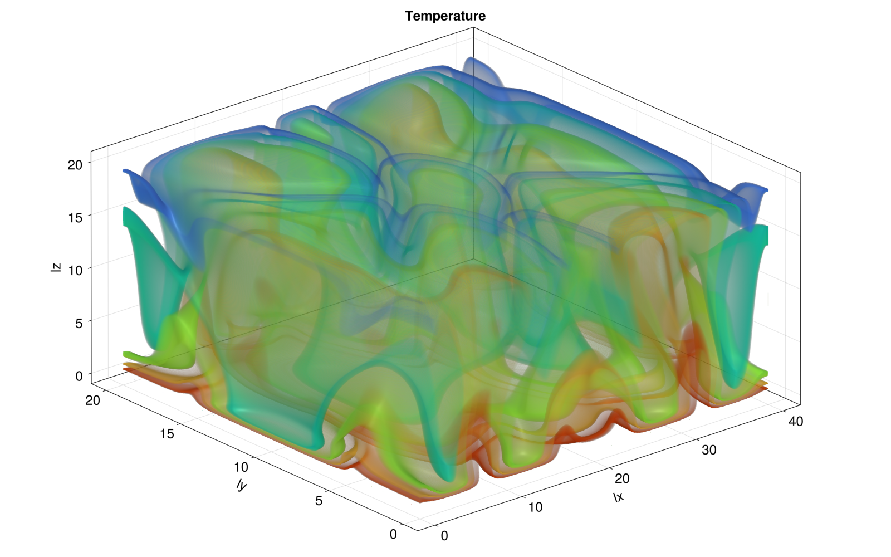
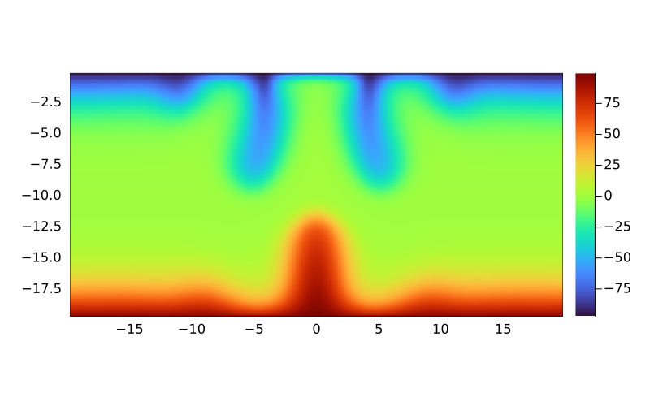

# PorousConvection

In this mini-project, a stencil-based solver has been developed to simulate porous convection in 2D and 3D staggered grid domains. In the first section, we explore the use of [ParallelStencil.jl](https://github.com/omlins/ParallelStencil.jl) to simulate a 2D porous convection model on xPUs (referring to both CPUs and GPUs). A similar approach is made to simulate a 3D porous convection model on xPUs in the second section. In the last section, we exploit the seamless incorporability of [ImplicitGlobalGrid.jl](https://github.com/eth-cscs/ImplicitGlobalGrid.jl) with [ParallelStencil.jl](https://github.com/omlins/ParallelStencil.jl) to simulate 3D porous convection using a multi-GPU configuration via [MPI.jl](https://github.com/JuliaParallel/MPI.jl). The bonus section involves the use of a popular automatic documentation tool [Literate.jl](https://github.com/fredrikekre/Literate.jl).

[ParallelStencil.jl](https://github.com/omlins/ParallelStencil.jl) ensures that a single Julia script allows for the implementation of a stencil-based solver on both CPUs and GPUs. Its seamless incorporability with [ImplicitGlobalGrid.jl](https://github.com/eth-cscs/ImplicitGlobalGrid.jl) becomes a powerful tool for multi-XPU implementations. The reason being that [ImplicitGlobalGrid.jl](https://github.com/eth-cscs/ImplicitGlobalGrid.jl) condenses necessary [MPI.jl](https://github.com/JuliaParallel/MPI.jl) code blocks into simple functions such as `update_halo!` (updating local domain boundary conditions between separate processes) and `gather!` (particularly used as a visualization tool in this project, gathers the arrays from the local processes to form a single global array). [ImplicitGlobalGrid.jl](https://github.com/eth-cscs/ImplicitGlobalGrid.jl) also provides us with a `@hide_communication` macro which helps us hide communication between the processes behind computation which helps reduce the total execution time of our simulation on multiple processes.

## Physical Model (Partial Differential Equations)

#### Fluid Flow in Porous Media

In our physical model, the fluid is considered to be incompressible (i.e., $\rho$ remains constant) and hence we obtain the following conservation of mass equation.

$$
\nabla \cdot(\phi \boldsymbol{v})=0
$$

Here, $\phi$ is the porosity which remains constant if our porous material is undeformable. In our numerical solution, we assume the porosity to be constant.

#### Darcy's Law

We define a quantity $\boldsymbol{q}_{\boldsymbol{D}} = \phi \boldsymbol{v}$ called the Darcy flux or Darcy velocity.  

$$
\boldsymbol{q}_{\boldsymbol{D}}=-\frac{k}{\eta}(\nabla p-\rho \boldsymbol{g})
$$

We obtain the pressure residual by substituting the Darcy flux into the mass conservation equation for an incompressible fluid. We get the following equation:

$$
\nabla \cdot\left[\frac{k}{\eta}(\nabla p-\rho \boldsymbol{g})\right]=0
$$

#### Heat Convection in Porous Media

The following equation represents the energy conservation equation for the fluid in porous media:

$$
\rho c_p \frac{\partial T}{\partial t}+\rho c_p \boldsymbol{v} \cdot \nabla T+\nabla \cdot \boldsymbol{q}_{\boldsymbol{F}}=0
$$

where $c_{p}$ is the specific heat capacity of the fluid, $\boldsymbol{q}_{\boldsymbol{F}}$ is the conductive heat flux and $t$ is the physical time.

Analogous to Darcy's law, there exists the Fourier's law which relates the conductive heat flux to the temperature gradient:

$$
\boldsymbol{q}_{\boldsymbol{F}}=-\lambda \nabla T
$$

where $\lambda$ is the thermal conductivity (which is assumed constant in our simulation). By substituting the Darcy Law and the Fourier's Law in the energy balance equation we obtain:

$$
\frac{\partial T}{\partial t}+\frac{1}{\phi} \boldsymbol{q}_D \cdot \nabla T-\frac{\lambda}{\rho c_p} \nabla \cdot \nabla T=0
$$

The above equation represents the transient advection-diffusion equation where the Darcy flux term contributes to the advection of the temperature and the temperature is diffused with the diffusion coefficient ($\lambda /(\rho c_p)$). This equation is also the temperature residual in our simulation to observe the convergence of our stencil-based solver.

#### Boussinesq Approximation
In order to account for the buoyancy which is observed by the change in fluid density as a function of temperature. We incorporate this via a linear dependency of fluid density on the temperature as shown below:

$$
\rho=\rho_0\left[1-\alpha\left(T-T_0\right)\right]
$$

However, one may think that so far we have assumed to incorporate an incompressible fluid in all our equations. Our approach continues to remain correct since we have applied what is known as the Boussinesq approximation. The gravitational term $\rho \boldsymbol{g}$ is responsible for the dominant contribution in the force balance and hence, variations in density due to the temperature are accounted for in the gravitational term only. Substituting this linear dependency of density on the temperature in the Darcy flux we obtain:

$$
\boldsymbol{q}_{\boldsymbol{D}}=-\frac{k}{\eta}\left(\nabla P-\rho_0\left[1-\alpha\left(T-T_0\right)\right] \boldsymbol{g}\right)
$$

#### Final System of PDEs
To obtain our final system of coupled PDEs, we incorporate two simplifications to our equations:

1. We do not solve for the absolute values of temperature and pressure but their deviations from the hydrostatic gradient and the reference temperature respectively.

2. The Fourier heat flux ($\boldsymbol{q}_F$) is replaced by the temperature diffusion flux $\boldsymbol{q}_T = \boldsymbol{q}_F / (\rho_0 c_p)$, this reduces the number of independent variables within our code.

Incorporation of these simplifications yields the following system of coupled PDEs:

$$
\boldsymbol{q}_D=-\frac{k}{\eta}\left(\nabla p-\rho_0 \alpha \boldsymbol{g} T\right) 
$$ 

$$
\nabla \cdot \boldsymbol{q}_D=0 
$$ 

$$
\boldsymbol{q}_T=-\frac{\lambda}{\rho_0 c_p} \nabla T 
$$

$$
\frac{\partial T}{\partial t}+\frac{1}{\phi} \boldsymbol{q}_{\boldsymbol{D}} \cdot \nabla T+\nabla \cdot \boldsymbol{q}_T=0
$$

## Numerical Method (Pseudo-transient solver)
The numerical method used in our simulation is the pseudo-transient method. We create a pseudo-transient system of PDEs using the pseudo-time quantity $\tau$. While adding pseudo-physical terms into the governing PDEs, a key point to remember is that if the pseudo-time derivatives are set to zero, they should yield the original steady-state PDEs.

Inertial terms are added to the flux equations as follows:

$$
\theta_D \frac{\partial \boldsymbol{q}_{\boldsymbol{D}}}{\partial \tau}+\boldsymbol{q}_{\boldsymbol{D}}=-\frac{k}{\eta}\left(\nabla p-\rho_0 \alpha \boldsymbol{g} T\right) 
$$

$$
\theta_T \frac{\partial \boldsymbol{q}_{\boldsymbol{T}}}{\partial \tau}+\boldsymbol{q}_{\boldsymbol{T}}=-\frac{\lambda}{\rho_0 c_p} \nabla T
$$

where $\theta_D$ and $\theta_T$ are the characteristic relaxation times for pressure and heat diffusion respectively.

To the mass balance and energy balance equations, we add the compressibility terms. Particularly for the energy balance equation, we use a dual-time method by discretizing the physical time derivative as shown below:

$$
\beta \frac{\partial p}{\partial \tau}+\nabla \cdot \boldsymbol{q}_{\boldsymbol{D}}=0 
$$

$$
\frac{\partial T}{\partial \tau}+\frac{T-T_{\text {old }}}{\mathrm{d} t}+\frac{1}{\phi} \boldsymbol{q}_D \cdot \nabla T+\nabla \cdot \boldsymbol{q}_T=0
$$

In the above equation, $\beta$ refers to the pseudo-compressibility and $T_{\text{old}}$ is the temperature profile of the domain in the previous physical time step.

The pseudo-transient method is quite a powerful tool as it allows for implicitly solving a system of PDEs without the need for solving a system of linear equations. This makes the former method converge faster as it does not face any time-step stability issues and also does not involve expensive matrix inversions. It is very beneficial for solving equations in which we wish to infer the steady state solution of concentration, temperature etc. in a physical process.

## Section 1: Porous Convection 2D
In this section, we develop a two-dimensional porous convection model having a domain size `nx, ny = 1023, 511` for `nt = 4000` iterations. The simulation can be performed on both GPUs and CPUs via a single code file titled `PorousConvection_2D_xpu.jl`.

*Figure 1: Temperature distribution and two-dimensional porous convection model simulated on a single GPU*

## Section 2: Porous Convection 3D
In this section, we develop a three-dimensional porous convection model having a domain size `nx, ny, nz = 255, 127, 127` for `nt = 2000` iterations. The simulation can be performed on both GPUs and CPUs via a single code file titled `PorousConvection_3D_xpu.jl`.

*Figure 2: 2D slice of the final temperature distribution of a three-dimensional porous convection model simulated on a single GPU*

*Figure 3: Final temperature distribution of a three-dimensional porous convection model simulated on a single GPU*

## Section 3: Porous Convection 3D MPI
In the section, we develop a multi-xPU configurated simulation for a three-dimensional porous convection model having a global domain size `nx, ny, nz = 508, 252, 252` for `nt = 2000` iterations. The simulation can be performed on multi-xPU configurations via the code file titled `PorousConvection_3D_multixpu.jl`.

*Figure 4: 2D slice of the final temperature distribution of a three-dimensional porous convection model simulated on 8 GPUs*

*Figure 5: Temperature distribution of a three-dimensional porous convection model simulated on 8 GPUs*

## Discussions and Conclusion

The 2D porous convection model indicates a temperature Gaussian that moves in the upward direction due to the temperature gradient in between the y-axis boundaries. Similarly, in the 3D Porous Convection model the final temperature profile indicates a heat flux between the xy plane boundaries due to a temperature gradient. Our Julia scripts are able to successfully simulate both configurations on CPUs as well as GPUs but we perform our simulation on a single GPU since we wish to achieve faster convergence for large grid sizes and for a greater number of physical time steps.

The 3D Porous Convection simulation on 8 GPUs also indicates a heat flux between the xy plane boundaries due to a temperature gradient. Leveraging [ImplicitGlobalGrid.jl](https://github.com/eth-cscs/ImplicitGlobalGrid.jl) for our multi-xPU simulation of the 3D Porous Convection model enables us to simulate the physical process in a domain that is 8 times the size of the domain simulated by a single GPU within comparable order of the execution time (for the same number of physical time steps). Our Julia script also allows for simulations on multiple CPU cores but for faster convergence we have yet again opted for a multi-GPU configuration in our simulation.

The simulations presented in the sections above are in tandem with the results expected from physics and this indicates that the combined use of 
[ParallelStencil.jl](https://github.com/omlins/ParallelStencil.jl) and [ImplicitGlobalGrid.jl](https://github.com/eth-cscs/ImplicitGlobalGrid.jl) is truly a remarkable tool for solving physical processes governed by partial differential equations. 

## Bonus Section: Documentation 
In this bonus section, we use [Literate.jl](https://github.com/fredrikekre/Literate.jl) to automatically render Julia scripts into Markdown files. The Julia script is titled `bin_io_script.jl` and the Markdown rendered file obtained via [Literate.jl](https://github.com/fredrikekre/Literate.jl), present in the `md` directory, is titled `bin_io_script.md`. 
