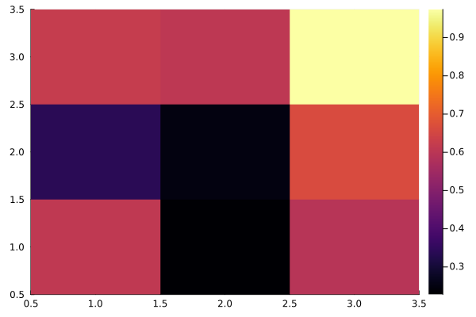

````julia
using Plots

"""
    save_array(file_name, array)

Saves an array variable `array` to the file titled `file_name.bin`.
"""
function save_array(Aname,A)
    fname = string(Aname,".bin")
    out   = open(fname,"w"); write(out,A); close(out)
end

"""
    load_array(file_name, array)

Loads an array variable `array` from the file tilted `file_name.bin`.
"""
function load_array(Aname,A)
    fname = string(Aname,".bin")
    fid   = open(fname,"r"); read!(fid,A); close(fid)
end

function main()
    A = rand(Float64, (3, 3))
    B = zeros(3, 3)
    save_array("random_array", A)
    load_array("random_array", B)
    return B
end

B = zeros(3, 3)
B = main()
heatmap(B)
````


