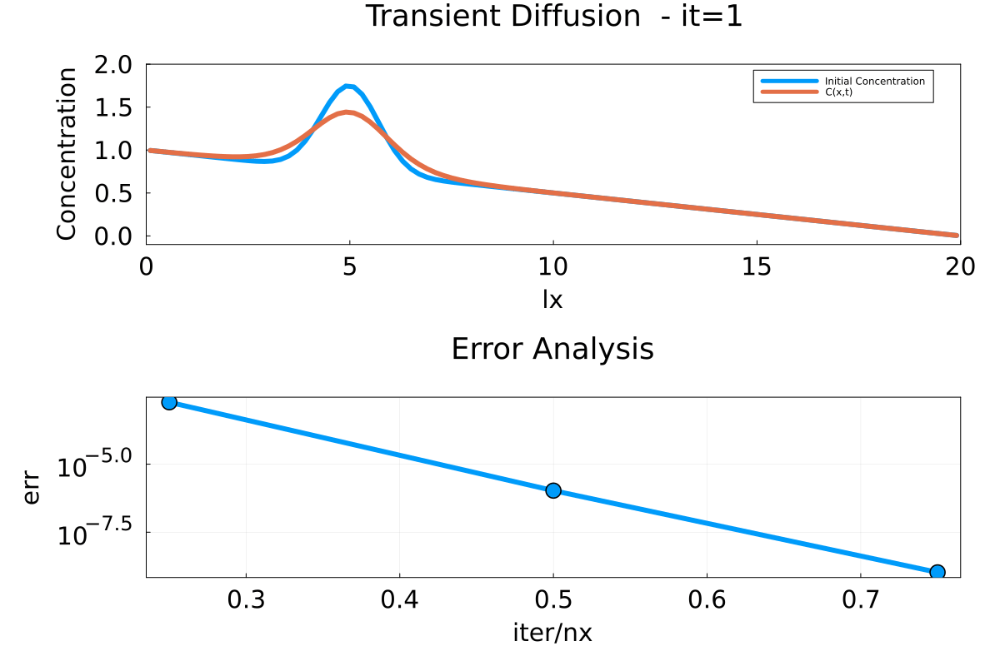
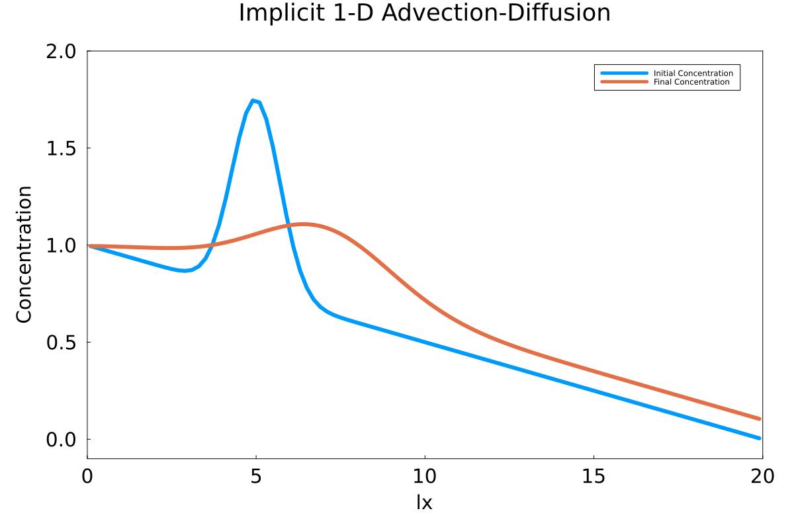
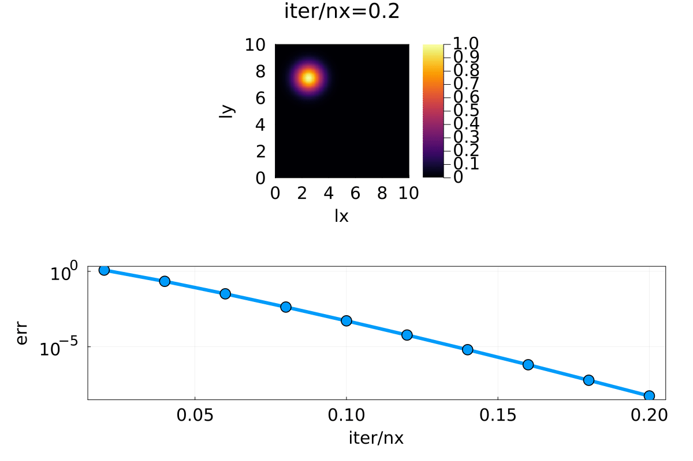
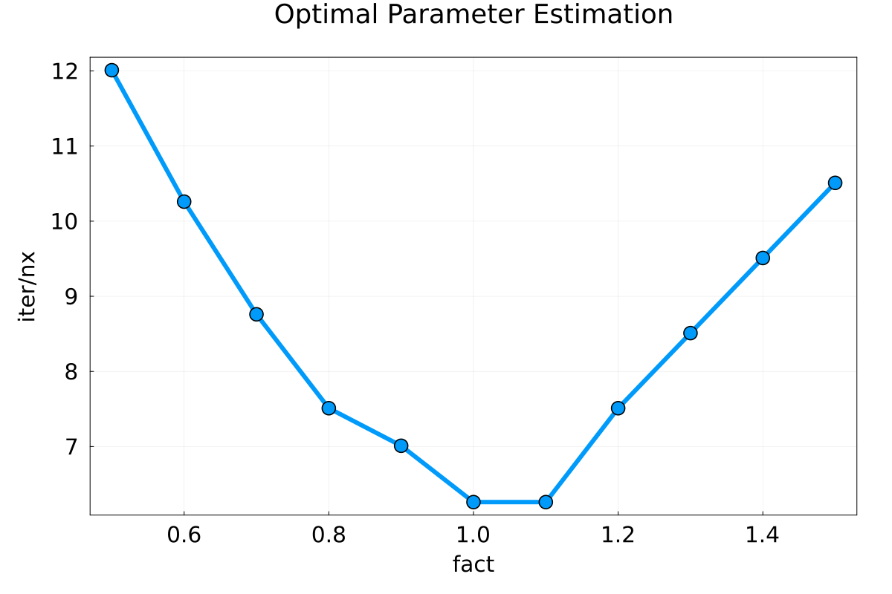

# Lecture 3 Exercise - Answers

### Exercise 1

The gif for implicit transient diffusion in 1D (nt = 10, i.e., physical time steps) is provided below. We can observe that the peak in the figure is actually spreading out and reducing in magnitude which is in tandem with the physics of diffusion. 

### Exercise 2

The final concentration and the initial concentration for the one-dimensional advection-diffusion phenomenon is reported below for nt = 10 physical time steps. It can be observed that the peak has shifted in the x-direction, indicating advection, and it has also shortened in height which indicates diffusion.

### Exercise 3

##### Task 1

The following figure represents transient-diffusion in a 2D setting with physical time steps nt = 50. The initial condition is similar to a Gaussian shifted from the origin, at which the concentration slowly reduces with each time step (indicated by color changes at the peak).  

##### Task 2 

We now couple the transient-diffusion process with advection (physical time steps are nt = 50). The heatmap is in tandem with the physics since the velocities are $v_x$ = 10 and $v_y$ = - 10 and the movement of the peak is in the same direction. Also, the initial concentration peak reduces with time (indicating diffusion).

### Exercise 4

We take up the problem solved in Exercise 1 and attempt to find a parameter suitable for our pseudo time-steps that will help accelerate our convergence. It is observed that for an re (Reynolds number) of 1.1 or 1 times 2π, the number of iterations per finite difference cell (iter/nx) is the lowest for our solver to converge. 

