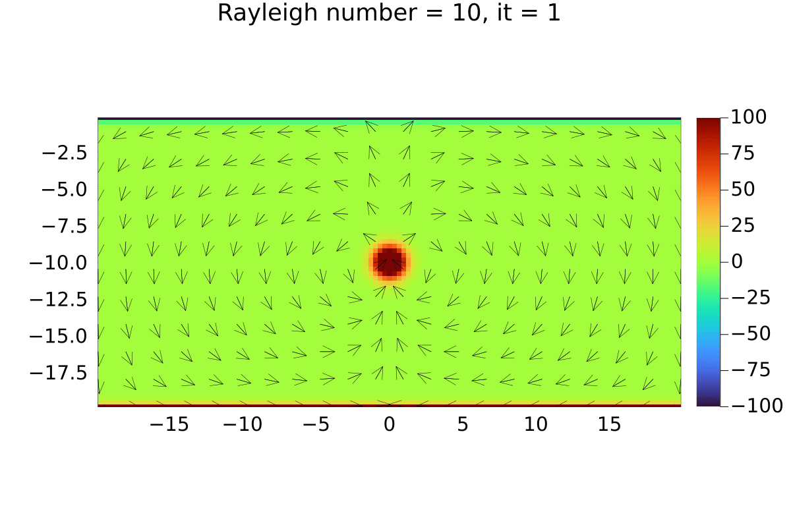
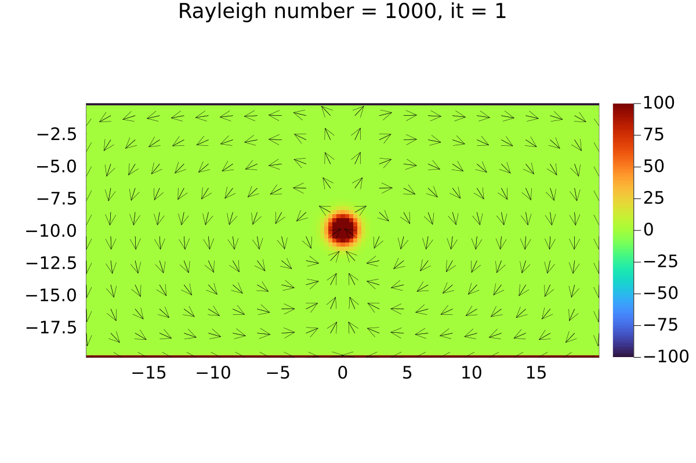

# Lecture 4 Exercise - Answers

### Exercise 1

##### All Tasks

A gif of 2D porous convection solved by implicit pressure update and explicit temperature update is provided below. The Boussinesq approximation has been taken into account and the Rayleigh number is equal to 1000.

### Exercise 2

##### Task 1 and 2

A gif of 2D porous convection solved by implicit pressure update and implicitt temperature update is provided below. The Boussinesq approximation has been taken into account ensuring complete coupling of the pressure and temperature equations. The Rayleigh number considered is equal to 1000.

The number of iterations per finite difference cell for a fully-coupled implicit solver of the pressure and temperature equations is in the range 5-7 per physical time step. However, it is in the range 7-8 per physical time step for the partial implicit solver. The reason being that in the explicit case we have to worry about the physical time step and try to keep it small in order to ensure that there are no time stability issues. A greater time step would help us reach convergence in lesser iterations. The time step `dt` is directly proportional to distance between the finite difference cell centres `min(dx,dy)` for the implicit case as opposed to `dt` being directly proportional to `min(dx,dy)^2`, hence the explicit temperature update takes a greater number of iterations per finite difference cell compared to the implicit temperature update.

##### Task 3

For `Ra = 10`, it can be observed that the Gaussian peak diffuses quickly in comparison to convection. There is little or no motion of the peak in the y-direction.

For `Ra = 40`, the Gaussian peak has greater motion in the y-direction as compared to the previous case, the diffusion is still faster compared to convective transport but convection begins to occur.

For `Ra = 100`, there is definitive movement of the Gaussian peak in the y-direction indicating convection.  

For `Ra = 1000`, there is greater movement of the Gaussian peak in the y-direction compared to he previous case indicating that convection is taking place at a quicker rate.

From the above figures, it can be clearly seen that convection takes place for `Ra > 40` whereas there is no convection when `Ra < 40`. Also the greater the value of Ra, the greater is the convective thermal transport compared to diffusive thermal transport. This is in tandem with the definition of Rayleigh number which is stated as:

$$
Ra = \frac{\text{Time scale for diffusive transport}}{\text{Time scale for thermal convective thermal transport}}
$$

The above formula also suggests that greater the Rayleigh number, the greater is the time taken for diffusive thermal transport compared to convection.