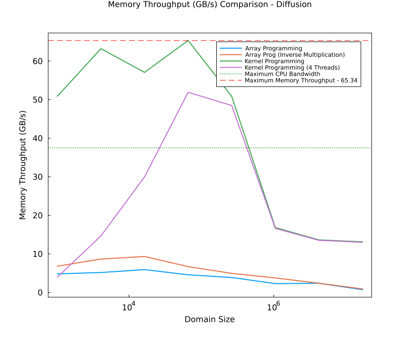

# Lecture 5 Exercise - Answers

**NOTE**: For all the scripts in the Exercises/Tasks involving the diffusion solver, I have used the exact number of memory accesses depending on the size of the flux and pressure matrices.

### Exercise 1

The following scripts have been completed and submitted in the `Pf_diffusion_2D` folder:

1. `Pf_diffusion_2D_Teff.jl`
2. `Pf_diffusion_2D_perf.jl`
3. `Pf_diffusion_2D_perf_loop.jl`
4. `Pf_diffusion_2D_perf_loop_fun.jl`

### Exercise 2

##### Task 2

The figure reported below represents the variation of the CPU's maximum memory throughput ($T_{peak}$) with respect to the domain size for Kernel vs Array Programming (using BenchmarkTools). It also indicated the CPU's maximum bandwidth (provided by the vendor) as well as the maximum values for the memory throughput if we evaluate it via a manual implementation. Note that the number of threads considered for the kernel programming approach is 4 (since it was equal to the number of cores on my CPU). Also, the function under consideration computes the sum of two arrays and assigns it to a third array (3 memory accesses).


The performed test assesses the change in memory throughput as we vary the domain size. It also compares the two approaches that are implemented in iterative stencil-based solvers within Julia: array and kernel programming. The memory throughput is also compared with the vendor-announced peak memory bandwidth for the CPU.

 Apart from minor deviations, we can observe that by both approaches to evaluating the memory throughput (i.e., using manual implementatation and the BenchmarkTools package), the kernel programming approach achieves a similar memory throughput compared to array programming. However, a thorough analysis is required and we implement that in task 3 for diffusion solvers which have greater memory accesses per iteration.

A key observation from the plot reveals that for a smaller domain size ($< 10^{5}$ grid points), the memory throughput is greater than the vendor-announced peak CPU memory bandwidth. This is because for smaller domain sizes, the grid is small enough to fit within the cache memory and data is fetched by our program from the cache memory resulting in a higher memory throughput. However, larger domain sizes do not fit in the cache memory and require to be accessed from the main memory resulting in a lower memory throughput.

##### Task 3

The figure reported below compares the Memory Throughput ($T_{eff}$) and the domain size for 4 separate implementations of a diffusion solver. It also indicates the maximum memory throughput achieved and the CPU maximum memory bandwidth. The BenchmarkTools package in Julia has been used to evaluate the memory throughputs.



The performed test assesses which solver has better memory throughput by comparing two versions of array programming and two versions of kernel programming via a domain size vs memory throughput plot.  

In comparison to task 3, which only has 3 memory accesses per iteration whereas the diffusion solvers have 10 memory accesses per iteration, we can observe greater difference in the memory throughputs of the kernel programming solvers compared to the array programming solvers. The array programming solvers have a memory throughput of less than 10 GB/s for all domain sizes. The kernel programming solvers have a greater memory throughput for all domain sizes in comparison to the array programming solvers. The results of the test are in tandem with the theoretical hypothesis which states that kernel programming usually has a higher memory throughput in comparison to array programming for Julia programs.

### Exercise 3
```
Test Summary:         | Pass  Total  Time
Diffusion Solver Test |    4      4  0.0s
```
