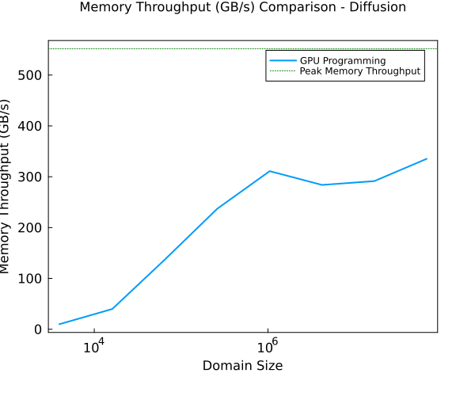

# Lecture 6 Exercise - Answers

### Exercise 1

```
T_eff_task5 / T_peak = 0.9437147328926775
T_eff_task5 / T_peak_theoretical = 0.9477717015456782
```

The above represents the maximum percentage of the peak memory throughput that can be achieved by the temperature solver. The first value is the fraction with respect to the $T_{\text{peak}}$ obtained using the memory copy function. The seconf value is the fraction with respect to the theoretical (vendor published values) value of $T_{\text{peak}}$ for a Tesla P100 GPU. It can be observed that we can access 94.7% of the vendor provided value for the Tesla GPU. Due to memory overhead and latencies, we cannot achieve the highest possible memory throughput of a GPU.

### Exercise 2

##### Task 2
A test comparing the values obtained by the GPU and CPU programming code is provided in `Pf_diffusion_2D_perf_gpu_test.jl`. One test ensures if the sizes of the two arrays obtained is the same and the other checks if the values in both the CPU and GPU programming obtained Pressure arrays are the same.

##### Task 3
The $T_{\text{peak}}$ that is observed in the Task 4 graph is obtained from the `T_peak_evaluation.jl` script.

##### Task 4



The peak memory throughput value obtained in Task 3 is 551 GB/s which is very close to the peak theoretical value of the P100 GPU, i.e. 561 GB/s. The observed memory throughput increases with an increase in the domain size due to the greater amount of memory accessed over time. When we run the memory copy operation, we can achieve the peak memory throughput since only a single operation is run. But since multiple operations are run in our diffusion solver, our memory throughput never reaches the peak memory throughput.

### Exercise 3

The unit tests and reference tests required for Exercise 3 are presented in the `L6Testing` folder.