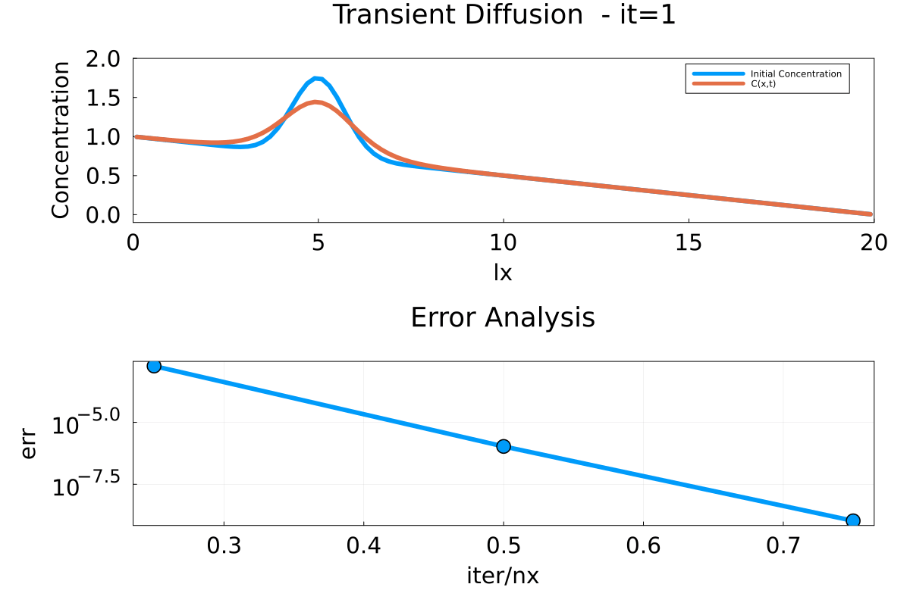
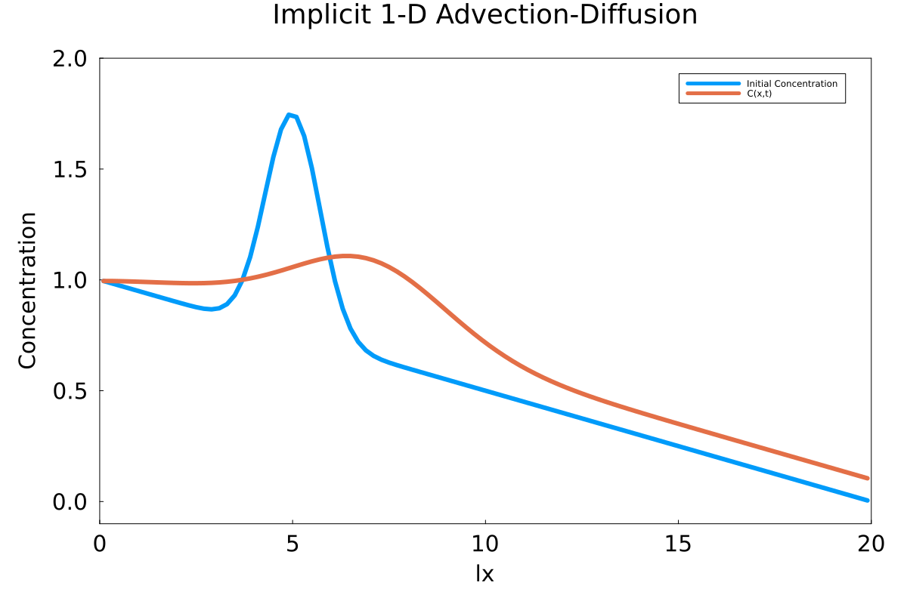
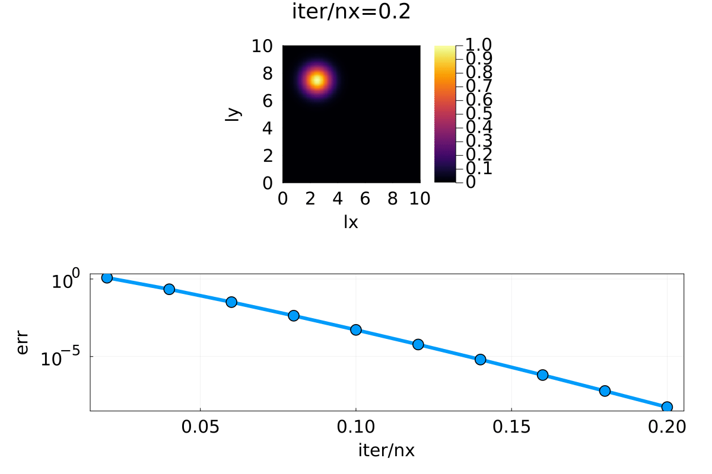

# Lecture 3 Exercise - Answers

### Exercise 1

The gif for implicit transient diffusion in 1D (nt = 10, i.e., physical time steps) is provided in Figure 1.

### Exercise 2

The final concentration and the initial concentration for the one-dimensional advection-diffusion phenomenon is reported in Figure 2 for nt = 10 physical time steps.

### Exercise 3

##### Task 1 

##### Task 2 

### Exercise 4

