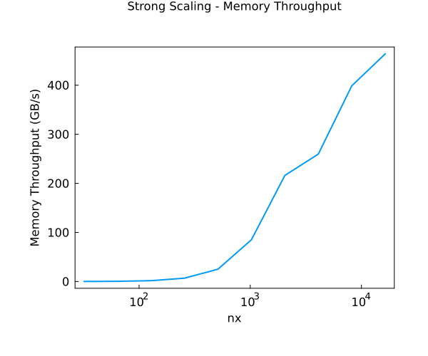
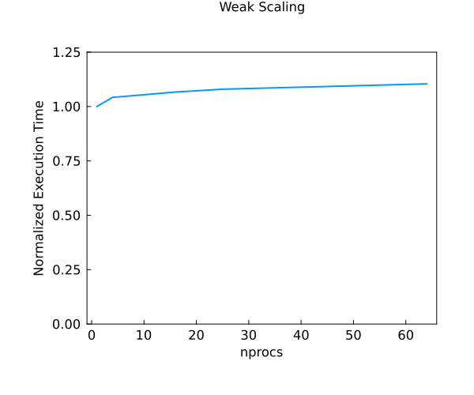
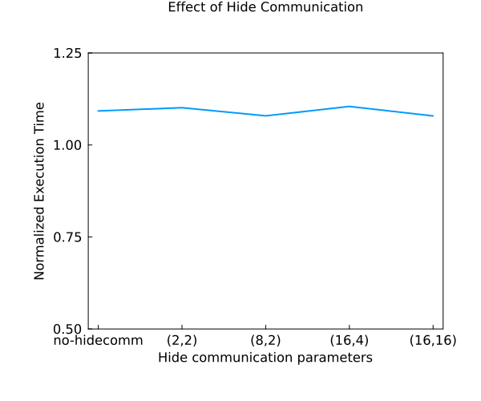

# Lecture 8 Exercise - Answers


### Exercise 1

##### Task 1 
The figure below shows that by plotting the concentration curve with halo updates (i.e., using fake parallelization), the same diffusion plot is obtained as without a split in the domain. If we do not update the boundaries, the code produces an abrupt plot indicating no connection between the parts of the domain.


The figure below shows the final concentration curve for diffusion by using n processes (in our case 4). After updating the local boundaries, we obtain a solution that matches with the solution obtained by solving for the complete domain. There exists no discontinuity within the solution. Without updating the local boundaries we will observe that there is no connection in between the segregated domain processes and the final concentration curve obtained is not smooth. (i.e. there is a discontinuity in the solution)


##### Task 2
The figure below represents the change in concentration of a Gaussian in a diffusion process. The differential equations have been solved on 4 MPI processes using CPU cores. We can observe that the animation is in tandem with the physics as the Gaussian peak tends to diffuse.


The command used to launch the MPI script (on the CPU) is as follows:
```
mpiexecjl -n 4 julia --project l8_diffusion_2D_mpi.jl
```

##### Task 3
The figure below represents the change in concentration of a Gaussian in a diffusion process. The differential equations have been solved on 4 MPI processes using GPU nodes. We can observe that the animation is in tandem with the physics as the Gaussian peak tends to diffuse.


The command used to launch the MPI script (on the GPU) is as follows:
```
mpiexecjl -n 4 julia --project l8_diffusion_2D_mpi.jl
```

### Exercise 2

##### Task 2
The following test checks if the difference between concentration arrays obtained by the single GPU and CPU-run simulations using `ParallelStencil.jl` is negligible. The test is contained in the `test_C.jl` file in the `src` folder.

```
Test Summary:                               | Pass  Total  Time
Single GPU & CPU Diffusion Array Comparison |    1      1  0.3s
```

##### Task 3
The following test checks if the concentration array obtained by muli-GPU (4 MPI processes) has the same size as the arrays obtained by single-GPU and single-CPU simulations (inner points). Tests are also made to check if there is a negligible difference between the arrays that are obtained by the multi-GPU simulation and the single-xPU simulations. The test is contained in the `test_C.jl` file in the `src` folder.

```
Test Summary:                 | Pass  Total  Time
Multi-GPU Implementation Test |    4      4  0.0s
```

##### Task 4
The figure below indicates the memory throughput $T_{\text{eff}}$ as a function of the number of cells in the x-direction (or, y-direction in our simulation) on a single GPU. This is done in order to identify the `nx` and `ny` that have the highest memory throughput on a single-GPU (i.e. the largest local problem possible on a single-GPU without compromising the performance of a single GPU) so that we can scale the problem to multiple GPUs. It is observed that the Memory Throughput increases as we increase the domain size from  `nx = ny = 32` to `nx = ny = 16384` and the highest memory throughput is for the latter.



##### Task 5
The figure below indicates the speed-up as a function of the number of processes. It is observed that the speed-up increases with the number of processes (with a minor deviation at 16 processes). This indicates an advantage of using weak-scaling of single-GPUs to multiple-GPUs for massive global problems. For weak scaling, I have picked `nx = ny = 8192` because my batch script used to time-out without compiling completely. The batch script is provided in `weak_scale_sbatch_mpi_daint.sh` in the `src` folder.



##### Task 6
The figure below indicates a comparison between the speed-up with change in the `@hide_communication` macro parameters. It is observed that for certain values of the parameters such as `(8,2)` and `(16, 16)` there is a speed-up in comparison to not using the `@hide_communication` macro. The value of these parameters is obtained by observing the maximum value of speed-up. 

 